# Poster Plan — Distance Scoring for GW Counterpart Candidate Vetting

## Research Question

**How can we quantitatively score the consistency between a candidate host galaxy's distance estimate and a gravitational-wave event's distance posterior — in a way that treats spectroscopic and photometric redshifts on equal footing, preserves the ranking of candidates, and is fast enough for real-time follow-up?**

Existing overlap metrics (Bhattacharyya coefficient) penalize precisely-measured spec-z hosts for width mismatch even when their distance is exactly right, while purely point-estimate methods discard the shape information that broad photo-z PDFs do carry. A single scoring statistic must ask the right question in each regime.

## Outcomes

We developed **Hybrid BC/Tophat V3**, a distance-scoring statistic that blends a heavy-tailed top-hat (consistency) branch with an analytic Bhattacharyya overlap branch, weighted by a logistic function of the host-to-GW width ratio (r₀ = 1, k = 4) and built on robust median/MAD statistics. Validated on 23 synthetic stress-case PDFs and 2112 real candidate hosts from S251112cm:

- Correctly scores perfectly-placed spec-z hosts at ~1.0 where the baseline BC gave 0.62.
- Preserves candidate ranking even far outside the GW posterior via the heavy-tailed top-hat.
- On real data, scores track the actual GW distance PDF, and V3 improves consistency for well-measured hosts in the 20–200 Mpc transition zone (score differences up to +0.6 over the previous hybrid).
- Runs in tens of microseconds per candidate — negligible against the ~7–10 s per-candidate network/DB wait in live follow-up.

## 1. Background & Motivation

Start with background about the BNS/Kilonova and the other things we are searching for
- Potentially even include SSM (Sub-solar mass events) as part of the discussion since S251112cm is a primary focus
- Include why we are able to see kilonovae, the time-domain astronomy aspect of it, and how we can combine photometric data with GW data to better identify candidates
- Introduce the concept of TROVE/SAGUARO and why the scoring matters
- GW events localize sources in 3D (sky area × luminosity distance). Optical surveys produce hundreds–thousands of transient candidates per event; the *distance posterior of each candidate's host galaxy* is one of the strongest discriminants we have — but only if we score the agreement between the two PDFs correctly.

## 2. Scoring Context

- Add the flowchart image of all of the different aspects of scoring (from Noah's distance scoring paper) — distance score is one term among several (sky position, photometric evolution, etc.)
- Potentially add some of the correlation analysis
- Transition to the distance scoring and how it is currently done: the **Bhattacharyya Coefficient (BC)**, `BC = ∫ √(p_GW · p_host) dD`

## 3. Design Requirements (what a "good" distance score is)

An explicit box on the poster, so each iteration can be judged against fixed criteria.

1. Bounded in [0, 1]; identical PDFs → 1; disjoint PDFs → 0.
2. A **spec-z galaxy at exactly the right distance must score ~1**, even though its PDF shape looks nothing like the GW posterior (this is where BC fails).
3. A **very broad / uninformative photo-z should score moderately** — a candidate we know nothing about should be neither rewarded nor excluded.
4. Score should **decline monotonically with offset** and preserve *ranking* (a 0.5σ candidate must beat a 1.5σ candidate — a hard box loses this).
5. Robust to **asymmetric/skewed photo-z PDFs** and outliers → median/MAD, not mean/std.
6. Fast and vectorizable — must run on thousands of candidates in real time during follow-up (S251112cm consideration).

## 4. spec-z vs photo-z: why one metric can't serve both (Maybe include this later on?)

- Short background box: what spec-z and photo-z are, typical uncertainties, and why the desired scores differ by regime.
- The GW distance distribution is roughly Gaussian and well-characterized; host distances come either from spectroscopic redshifts (near delta-functions) or photometric redshifts (broad, often asymmetric, sometimes nearly uninformative). A single naive overlap metric cannot serve both regimes — this is the thesis of the whole poster, and it's what every iteration below is converging toward.
- For sharp PDFs the right question is "is the point estimate consistent with the GW posterior?"; for broad PDFs it is "how much do the distributions overlap?" — the hybrid exists to ask each question in its proper regime.

## 5. Iterations of the Distance Score

> Figure convention in the repo plots: **red = GW posterior, gray = host galaxy PDF**. Same 20+ synthetic test cases (delta functions, wide/very-wide, offset, skewed) reused across every method, which makes side-by-side comparison honest.

### 5.0 Baseline: Bhattacharyya Coefficient — the motivating failure mode

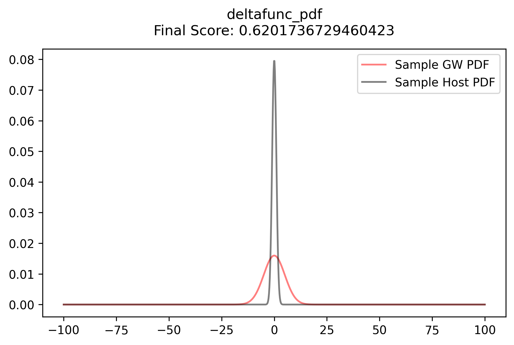

- `pres/bc/deltafunc_pdf.png` — a spec-z host **perfectly centered** on the GW mean scores only **0.62**. BC penalizes pure width mismatch even when the distance is exactly right: `BC_centered(r) = √(2r/(1+r²))` for width ratio r, so a correct sharp galaxy at r = 0.2 incurs a 38% penalty for being correct.
- Pair it directly with `pres/hybrid/deltafunc_pdf.png` (same case, hybrid score = **1.0**) as a before/after — this two-panel pair is the strongest single visual on the poster.

### 5.1 Information-theory metrics (JSD to GW posterior × JSD to uniform, + Wasserstein)

- Representative figure: 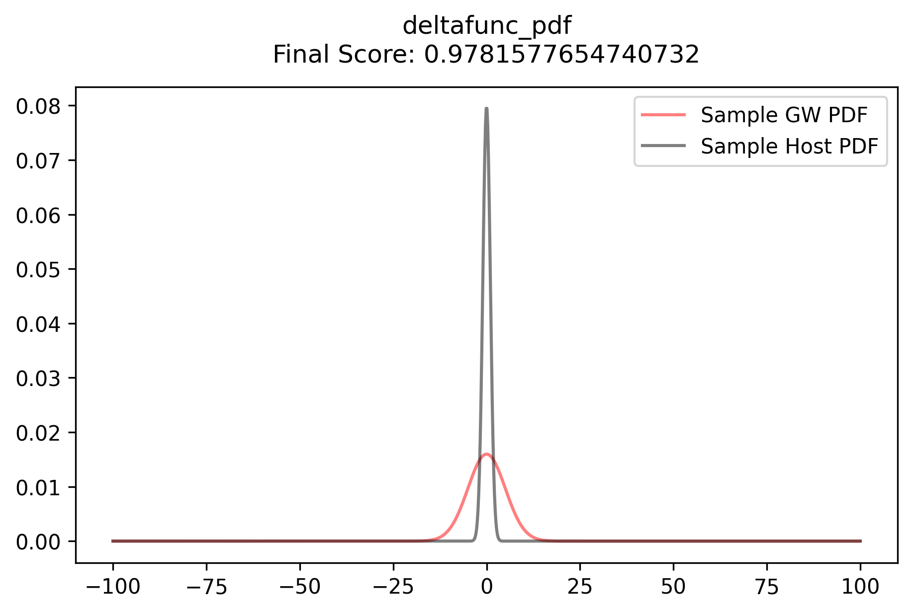 (score 0.978 on the centered delta — already better than BC, but the construction is ad hoc: hand-tuned 0.4/0.6 weights, expensive entropy integrals, and the "distance from uniform" term behaves poorly on finite grids).
- **Real-data figure:**

  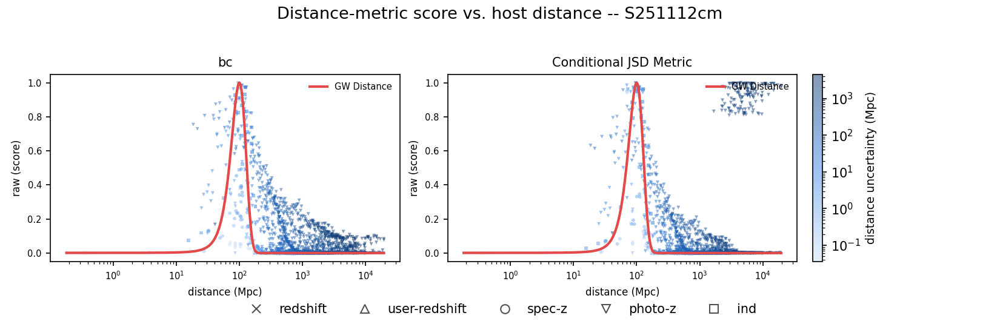

  The earliest two approaches on real S251112cm data — plain Bhattacharyya coefficient (`bc`) and the JSD/z-score hybrid (`Conditional JSD Metric`), both with the GW distance curve overlaid. `bc` tracks the GW distance curve fairly cleanly; `Conditional JSD Metric` mostly does too, but has a cluster of anomalously high scores (~0.8–1.0) for photo-z hosts out at ~2,000–10,000 Mpc — a clear failure mode of the pure JSD-based approach that motivated moving toward the Consistent Probability family.
- Verdict for poster: right instincts (separate shape agreement from information content), wrong machinery — and the real-data failure at large distance makes the case concretely.

### 5.2 Consistency-probability method

- Representative figure: 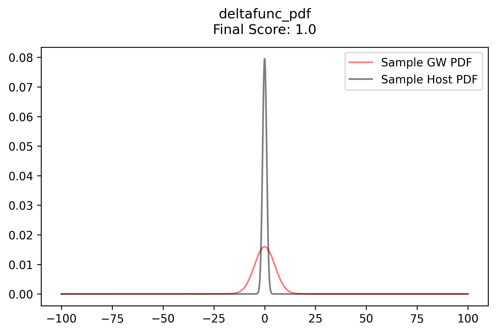 (centered spec-z now correctly scores **1.0**).
- Asks the right question for sharp PDFs via erfc of the scaled offset — but ignores the host PDF's shape, so it under-uses information when the photo-z is genuinely informative.

### 5.3 Hybrid methods

- **Hybrid idea:** blend a top-hat/consistency branch (best when host PDF is narrower than GW) with the BC overlap branch (best when comparably wide or wider), weighted by the width ratio r = σ_cand/σ_gw. Each branch answers the question it's good at; the weight decides which question to ask.
- **Real-data figure:**

  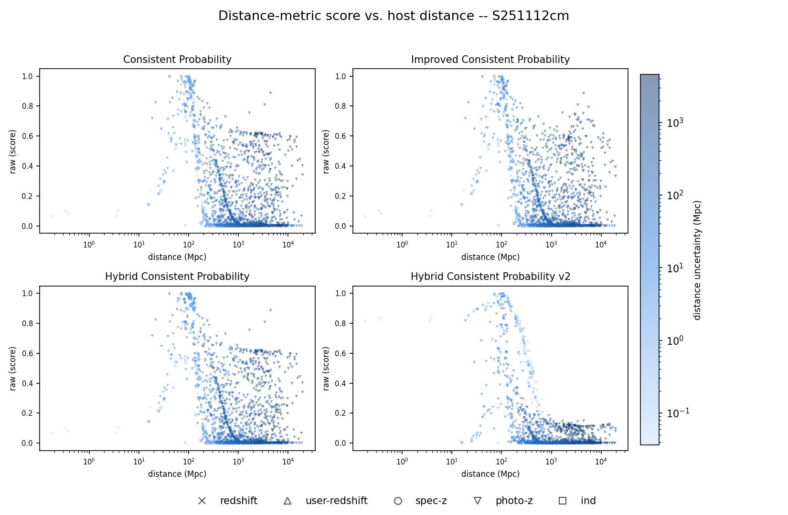

  Side-by-side with real S251112cm data across this whole stretch of iterations — Consistent Probability → Improved Consistent Probability → Hybrid Consistent Probability → Hybrid Consistent Probability v2, same axes/coloring throughout so the panels are directly comparable.

### 5.4 Robust statistics: median/MAD instead of mean/std (v1–v4)

- v1 = improved cons. prob. w/ mean+std, v2 = median+MAD, v3 = median+std, v4 = current cons. prob. w/ median+MAD. MAD variant uses Q86/Q14 (not Q75/Q25) so it limits to σ for a Gaussian.
- **Strength (real data):** Hybrid Consistent Probability v2 (median/MAD) tightens spec-z scores dramatically (log₁₀ score ~ −1 to −2) vs. the mean/std version's wide spread (median ~ −5 to −8).
- **Limitation (real data):**

  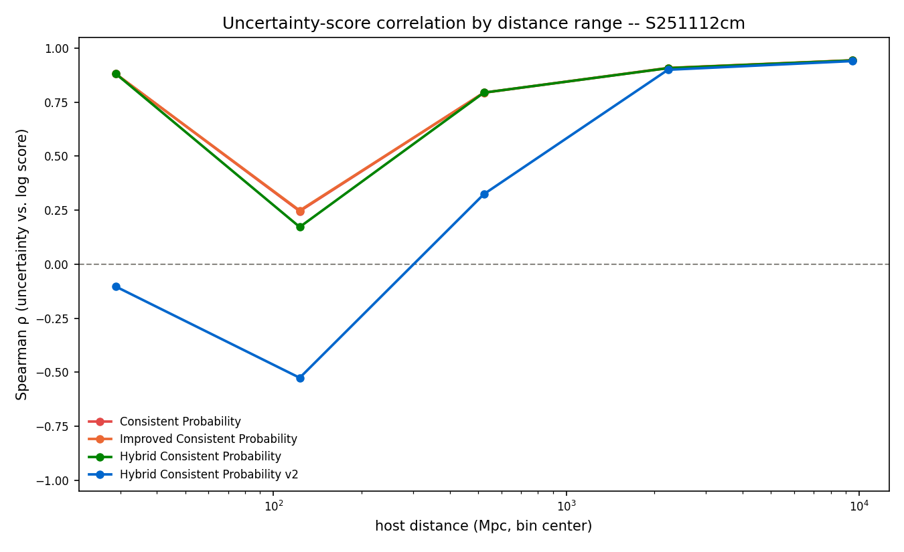

  That same v2 version's uncertainty-vs-score correlation actually goes negative at close range (~30–150 Mpc) — the opposite of the desired trend that the other three methods all get right. Worth showing as a "this fixed one thing but broke another" cautionary example; ties into the uncertainty/score correlation discussion in Real Data Considerations below.
- `hybrid_tests/v2_vs_v4_straddle.png` — already annotated for presentation: the constructed worst case where v4's "single facing tail" rule and v2's smooth two-tail blend differ. **Key result: the maximum disagreement across all 23 cases is only ~0.02**, so the simpler rule is safe (see `v2_vs_v4.md` — its Summary bullets are ready-made poster text).

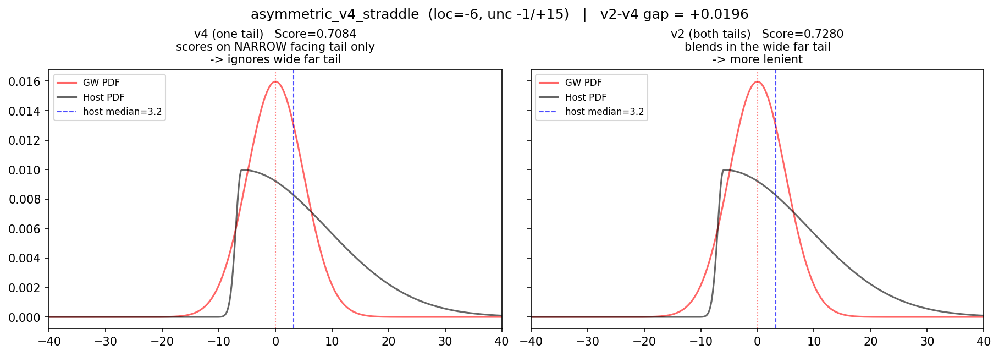

### 5.5 Noah's latest hybrid → hybrid_v3 improvements

**(a) New top-hat with heavy tail — preserves ranking beyond the box**

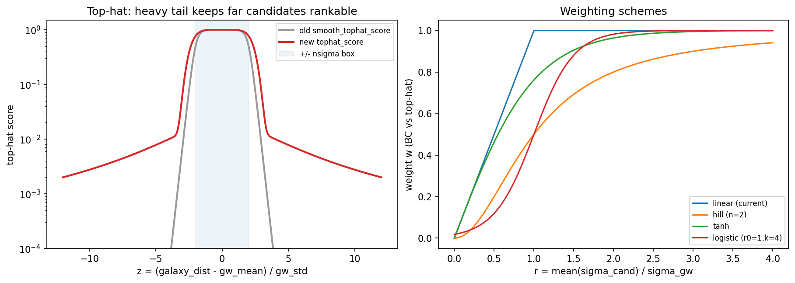

— The old smooth top-hat crashes below 10⁻⁴ past ~4σ, so a 5σ and a 10σ candidate become indistinguishable (rank information destroyed — the NOTES.md "0.5σ vs 1.5σ" objection, taken to its extreme). The new score keeps a slowly decaying floor (~10⁻²–10⁻³), so far candidates remain *rankable* while still clearly disfavored. The log-scale y-axis makes the point instantly.

**(b) Logistic branch weighting w(r) = 1/(1+e^{−k(r−r₀)}), r₀ = 1, k = 4**

- The parameter justification from NOTES.md is genuinely poster-worthy — condense to three bullets:
  1. **BC's own systematic error defines the handoff window**: BC_centered(r) ≥ 0.9 only for r ∈ [0.51, 1.96]; k = 4 puts the logistic's 12–88% transition exactly across it (w(0.5)=0.12, w(2)=0.98).
  2. **Continuity with the legacy linear ramp**: max slope k/4 = 1 matches the old `w = r` scheme, so intermediate cases score consistently with earlier versions.
  3. **Spec-z anchor**: w(0) ≈ 0.018 — a delta-function keeps ≥98% top-hat weight (linear weighting leaks ~10–20% to the broken-at-r=0 BC branch; that's the practical difference).
- Numeric evidence from the weight-scheme grids (`hybrid_new/weights/linear.png` vs `logistic.png`): centered spec-z case scores **0.924 (linear) → 0.985 (logistic)**. Cite the numbers rather than pasting these full grids (23-panel thumbnails, unreadable at poster distance). Also tested: tanh, Hill — one sentence, "logistic chosen for the three arguments above."
-  Clean plot of w(r) for linear vs logistic with the BC-trust window [0.51, 1.96] shaded and the anchor points (r = 0, 0.5, 1, 1.5, 2) annotated. This figure doesn't exist in the repo yet and would carry section (b) by itself.

### 5.6 Full-suite validation grid (appendix / backdrop panel)

- 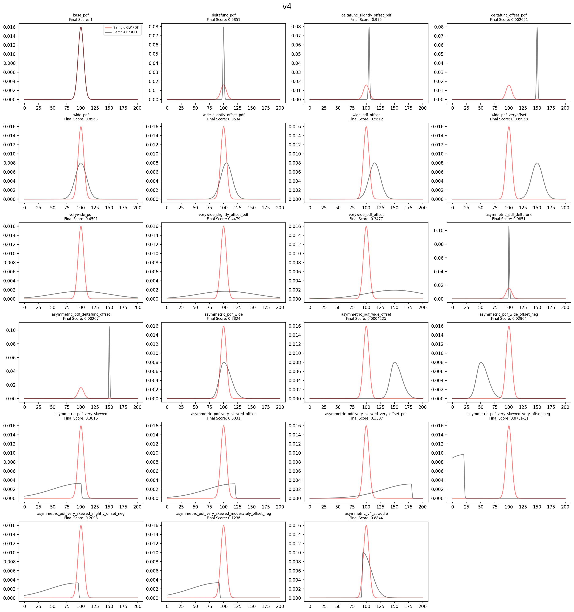 (or `hybrid_tests_v2_combined.png`) — the complete 23-case grid with final scores. Too dense to read case-by-case on a poster, but effective as a "validated against a systematic battery of synthetic PDFs" panel; readers scan the score progression (1.0 → 0.97 → 0.56 → 0.003 as offsets grow) and trust the method. Put it small, bottom corner, caption only.

## 6. Real Data Considerations (S251112cm results)

### 6.1 Matching expected distribution

- **Figure:**

  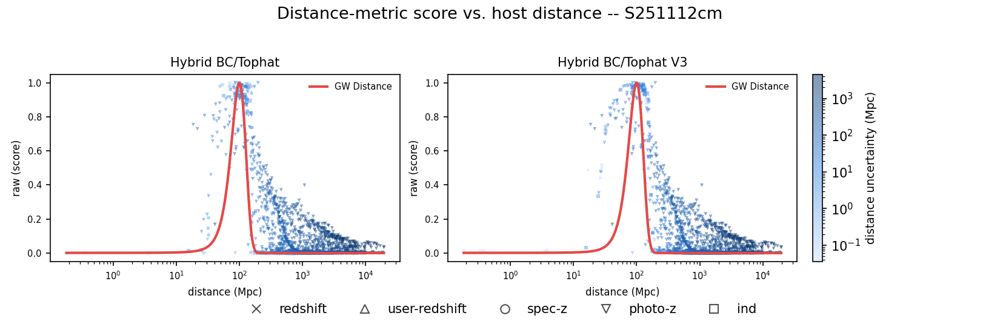

  GW distance curve (red, normalized to peak 1, built from the median test_mean/test_std across all 2112 evaluated hosts) overlaid on the score-vs-distance scatter — shows scores rising and falling with the real GW distance PDF shape rather than some arbitrary function of distance.
- Framing: bulk of unrelated field galaxies at low scores, uninformative photo-z's mid-range, and no artificial pileup at 0 or 1.
- **Real-data difference figure:**

  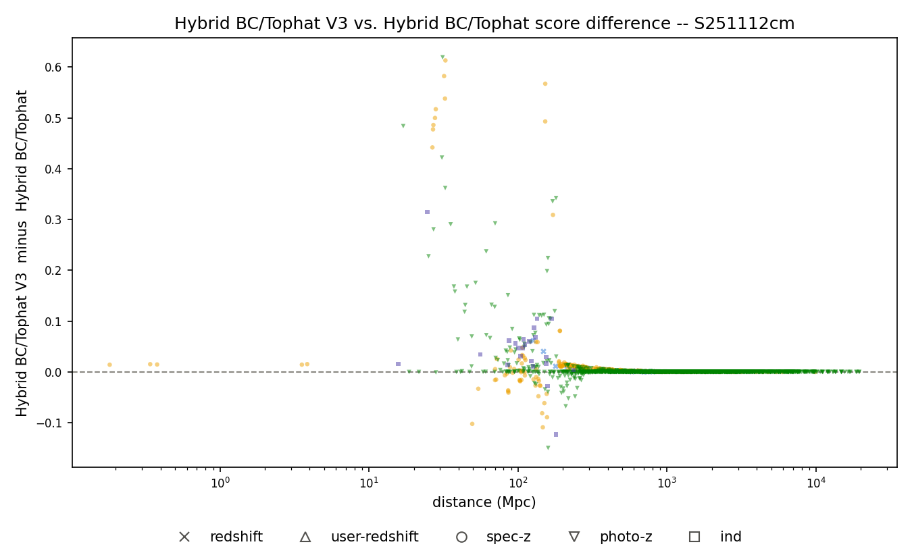

  (V3 − v1) score difference vs. distance — makes the strengths/limitations concrete instead of eyeballing two panels. V3 mostly agrees with v1 (diff ~ 0 almost everywhere), but in the ~20–200 Mpc transition zone V3 is more consistent for well-measured hosts near the true distance (diff up to +0.6), at the cost of slightly lower scores (diff down to −0.16) for well-measured hosts that are close but not exactly centered on the GW mean — a deliberate trade (V3's tilt term rewards exact centering over "anywhere in the box").

### 6.2 Time Efficiency

Per-call execution time of the distance-scoring metrics, measured on 40 real host records sampled from `distance_metric_bias_records.json`, 20 timed repeats per record:

| metric | mean (µs) | median (µs) | total (ms) |
|---|---|---|---|
| bc_slow | 334.96 | 323.89 | 13.399 |
| bc (analytic) | 15.73 | 14.87 | 0.629 |
| bc_norm | 11772.94 | 11595.85 | 470.918 |
| Consistent Probability | 2.45 | 2.17 | 0.098 |
| Improved Consistent Probability | 5.55 | 5.20 | 0.222 |
| Hybrid Consistent Probability | 8.37 | 7.79 | 0.335 |
| Hybrid BC/Tophat | 47.91 | 38.34 | 1.916 |
| Hybrid BC/Tophat V3 | 34.37 | 32.61 | 1.375 |

- `bc_slow`/`bc_norm` are the older numerical-integration metrics (build an AsymmetricGaussian PDF over a 100,000-point grid, then integrate) and aren't called anywhere in the current pipeline. `bc (analytic)` is the closed-form replacement now used internally by both Hybrid BC/Tophat metrics.
- The two active metrics (Hybrid BC/Tophat, Hybrid BC/Tophat V3) cost tens of microseconds per call — negligible next to the per-candidate network/DB wait (~7–10 s seen during real collection runs).

### 6.3 Correlation of distance_uncertainty/score (Is this really necessary?)

- **Figure:**

  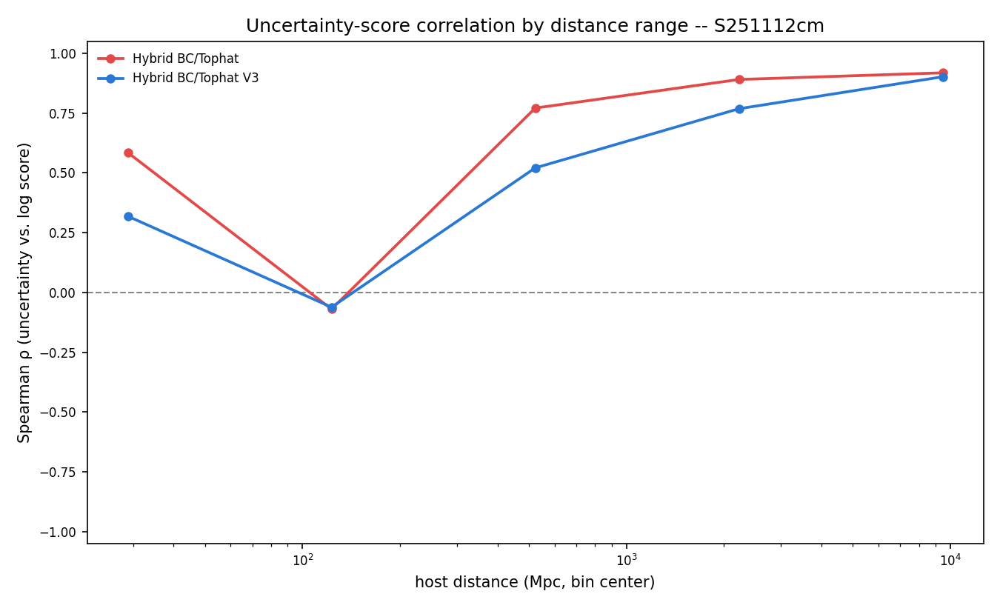

  Current Spearman ρ(uncertainty, score) by distance bin for Hybrid BC/Tophat vs. V3; both dip toward ~0 right around the GW peak (~120 Mpc) where uncertainty stops mattering much, and rise toward ~0.9+ far from it.
- Discussion framing: the score *should* correlate with uncertainty by design (requirement 3 pulls uninformative PDFs toward the middle). The open question is whether the near-peak dip is actually a problem or just reflects that uncertainty genuinely matters less when a host is obviously right — i.e., whether the *strength* of the correlation is appropriate, not whether it should exist.

## 7. Limitations & Future Work

- v4's one-tail rule vs v2's blend: known ≤0.02 discrepancy on straddling asymmetric PDFs (quantified, accepted).
- Asymmetric Gaussian is still an approximation for photo-z PDFs; real p(z) can be multimodal — median/MAD helps but doesn't capture multiple peaks.
- Parameter sensitivity: `out/params_sweep/` (nσ = 0.5–3.0 sweep + `scores.csv`) exists
- Peculiar-velocity / redshift→distance conversion uncertainty for very nearby events.
- Validation on a catalog with known hosts (past events with confirmed counterparts, or injected signals)
- TODO: Think more about what the actual limitations of the current method are?

## 8. Key Takeaways

1. BC alone **penalizes correct spec-z hosts by up to ~40%** purely for width mismatch.
2. A hybrid top-hat ⊕ BC score with **logistic width-ratio weighting (r₀=1, k=4)** and **median/MAD robust statistics** scores both spec-z and photo-z candidates correctly, validated on 23 synthetic PDF stress cases.
3. New heavy-tailed top-hat **preserves candidate ranking** even far outside the GW posterior — critical for prioritizing follow-up when nothing scores well.
4. Validated on **2112 real S251112cm hosts**: scores track the actual GW distance PDF, and the active metrics cost only **tens of µs per call** — negligible next to the ~7–10 s per-candidate network/DB wait.

---

## Figure shortlist (in priority order)

| # | File | Poster role | Why |
|---|------|-------------|-----|
| 1 | `pres/bc/deltafunc_pdf.png` + `pres/hybrid/deltafunc_pdf.png` | Motivation, side-by-side | The pathology (0.62) and the fix (1.0) in one glance |
| 2 | `hybrid_new/diagnostics/tophat_and_weighting.png` | hybrid_v3 improvement (a) | Poster-ready, log-scale, self-explanatory title |
| 3 | `real_data/distance_metric_bias_raw_score_vs_distance.png` + `real_data/distance_metric_bias_metric_diff_vs_distance.png` | hybrid_v3 on S251112cm | "Before/after on real data" — the strongest evidence the improvement matters in practice |
| 4 | `real_data/distance_metric_bias_raw_score_vs_distance.png` | Real-data validation | Scores track the actual GW PDF (2112 hosts), not an arbitrary function of distance |
| 5 | `hybrid_tests/v2_vs_v4_straddle.png` | Robust-stats iteration | Annotated worst case; shows rigor (gap only ~0.02) |
| 6 | *(to generate)* w(r) linear vs logistic curve with BC-trust window shaded | hybrid_v3 improvement (b) | The one missing figure; carries the r₀=1, k=4 story |
| 7 | `real_data/distance_metric_bias_uncertainty_score_corr_vs_distance.png` | Discussion panel | Frames the correlation question as intended behavior + open question |
| 8 | `hybrid_new/v4.png` | Validation backdrop (small) | "Tested on a 23-case synthetic battery" credibility panel |
| 9 | `out/jsd_uniform/deltafunc_pdf.png`, `pres/consistency_prob/deltafunc_pdf.png`, `real_data/distance_metric_bias_s251112cm_raw_score_vs_distance.png` | Optional mini-timeline strip | Same test case / same axes across all iterations = clean visual narrative |